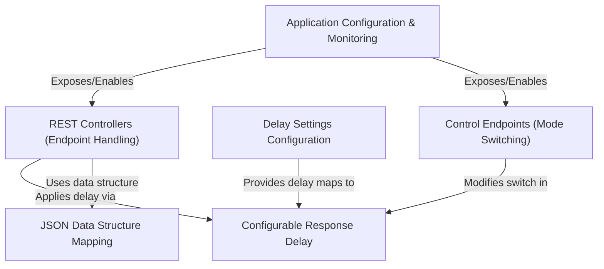
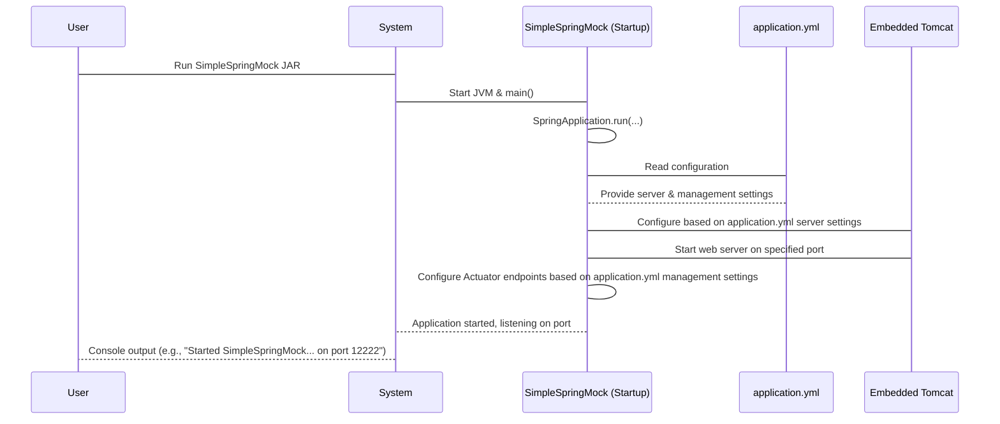
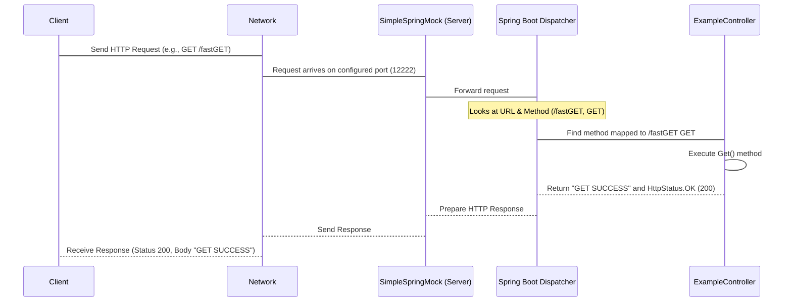
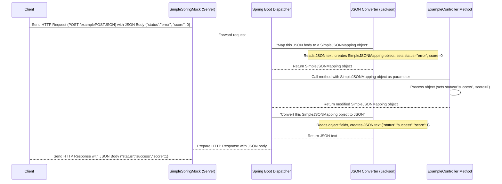
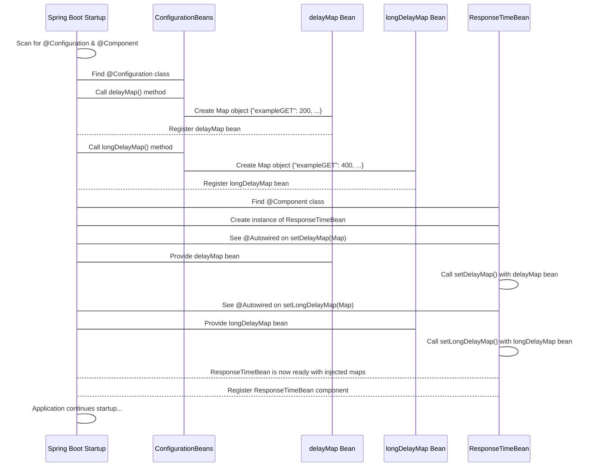
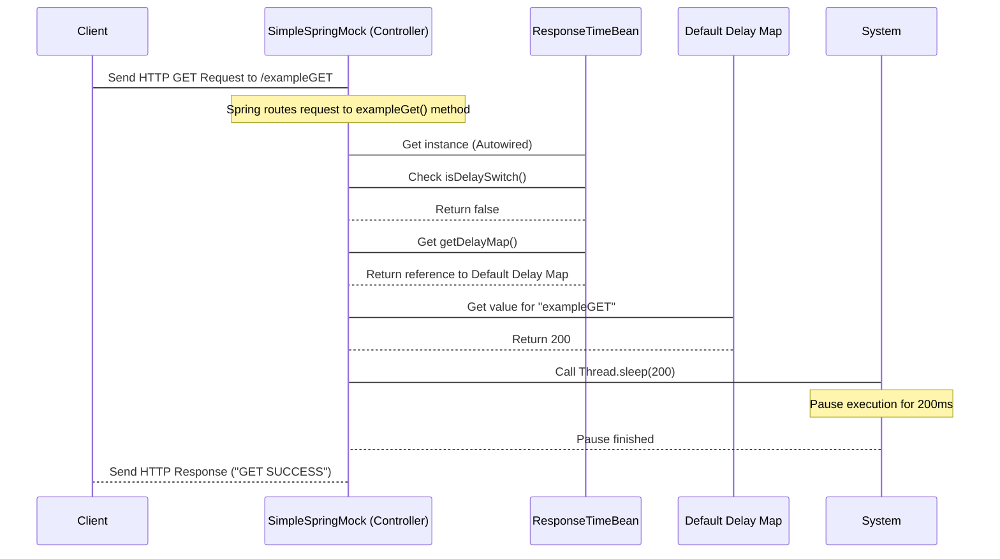

# Tutorial: SimpleSpringMock

This project, SimpleSpringMock, is a basic mock service built with Spring Boot.
Its main purpose is to **simulate RESTful web services** by handling common requests like GET and POST.
A key feature is the ability to introduce *configurable response delays*, allowing users to simulate network latency or test fault tolerance scenarios.
It also demonstrates handling specific *JSON and XML data structures* and provides *control endpoints* to switch delay modes dynamically without restarting.
Basic **application configuration** and integrated *monitoring capabilities* are included.


## Visual Overview



## Chapters

1. [Application Configuration & Monitoring
](01_application_configuration___monitoring_.md)
2. [REST Controllers (Endpoint Handling)
](02_rest_controllers__endpoint_handling__.md)
3. [JSON Data Structure Mapping
](03_json_data_structure_mapping_.md)
4. [Delay Settings Configuration
](04_delay_settings_configuration_.md)
5. [Configurable Response Delay
](05_configurable_response_delay_.md)
6. [Control Endpoints (Mode Switching)
](06_control_endpoints__mode_switching__.md)

---

<sub><sup>Generated by [AI Codebase Knowledge Builder](https://github.com/The-Pocket/Tutorial-Codebase-Knowledge).</sup></sub>

# Chapter 1: Application Configuration & Monitoring

Welcome to the first chapter of the SimpleSpringMock tutorial! In this chapter, we'll get our basic mock application up and running. Every application needs a place to live on the internet (like a house needs an address) and a way for us (or other systems) to check if it's healthy and working correctly.

This is exactly what **Application Configuration & Monitoring** is all about. We'll learn how to tell our SimpleSpringMock where to run (like on which network port) and how to enable some built-in tools that let us peek inside and see if it's doing okay.

Think about our SimpleSpringMock: its main job is to pretend to be another service for testing purposes. To do that, test systems need to know how to connect to it, and they need to be able to check if it's still "alive" during long test runs. This chapter shows you how SimpleSpringMock is set up to handle these basic needs.

## Setting the Stage: Where Does Our App Live?

When you run a web application, it needs to listen for incoming requests on a specific **port** on your computer or server. The port is like a specific door number at a street address. Clients (like a web browser or a test script) use this port number to connect to your application.

Our SimpleSpringMock also needs to know which port to use. How do we tell it? We use a configuration file!

Spring Boot applications (like SimpleSpringMock) often use a file named `application.yml` or `application.properties` to manage settings. `application.yml` is a popular format that uses indentation to organize settings, making it quite readable.

Let's look at the part of SimpleSpringMock's `application.yml` that deals with the server setup:

```yaml
server:
  port: 12222
  tomcat:
    max-threads: 200
    accept-count: 100
    min-spare-threads: 20
    max-connections: 10000
    mbeanregistry:
      enabled: true
```

This section tells the application's built-in web server (Tomcat, in this case) how to behave:

*   `port: 12222`: This is the most important one here for basic access! It means the application will listen for requests on port 12222. If you tried to access it, you'd use an address like `http://localhost:12222` (if running on your local machine).
*   The `tomcat` settings (`max-threads`, `accept-count`, etc.): These control things like how many incoming requests the server can handle at the same time (`max-threads`), how many connections can wait in a queue (`accept-count`), and other performance-related details. For a beginner, you don't need to worry too much about these advanced settings, but it's good to know they exist and can be configured here!

So, the `server` section in `application.yml` is where we configure the basic network address and capacity settings for our application.

## Keeping an Eye on Things: Monitoring with Actuator

Besides knowing *where* the application is, we also need to know *how* it's doing. Is it running? Is it healthy? Is it overloaded? This is where **monitoring** comes in.

Spring Boot comes with a powerful tool called **Actuator**. Actuator provides built-in "endpoints" (specific web addresses within your application) that expose information about the running application. These endpoints are super useful for monitoring, managing, and understanding what your application is doing.

SimpleSpringMock uses Actuator to provide information like:

*   **Health status:** Is the application still running and able to respond?
*   **Metrics:** Performance data, like how many requests it has handled or how much memory it's using.
*   **Prometheus metrics:** A specific format of metrics that is widely used by monitoring systems like Prometheus.

These Actuator features are enabled and configured in the `application.yml` file, in the `management` section:

```yaml
management:
  endpoint:
    health:
      enabled: true
    metrics:
      enabled: true
    prometheus:
      enabled: true
  endpoints:
    web:
      exposure:
        include: prometheus,metrics,health
```

Let's break this down:

*   `management.endpoint.health.enabled: true`: This turns on the `/actuator/health` endpoint. This endpoint tells you if the application is healthy (e.g., responding, connected to necessary services if any).
*   `management.endpoint.metrics.enabled: true`: This turns on the `/actuator/metrics` endpoint, which provides general application metrics.
*   `management.endpoint.prometheus.enabled: true`: This turns on the `/actuator/prometheus` endpoint, specifically formatted for Prometheus.
*   `management.endpoints.web.exposure.include: prometheus,metrics,health`: This is very important! By default, Actuator endpoints might not be exposed over the web for security reasons. This line *specifically lists* the endpoints (`prometheus`, `metrics`, `health`) that we want to make accessible via HTTP (usually under the `/actuator` path).

With this configuration, SimpleSpringMock will automatically provide health information and metrics when accessed via `/actuator/health` and `/actuator/prometheus` (or `/actuator/metrics`) once it's running.

## How Does It All Connect?

You might be wondering, how does the `application.yml` file actually affect the running code?

When you run a Spring Boot application, the `SpringApplication.run()` method is the starting point. This method does a lot of magic behind the scenes: it sets up the Spring environment, finds and configures components, and crucially, it reads configuration files like `application.yml`.

Look at the main application file, `SimpleSpringMock.java`:

```java
package SimpleSpringMock;

import org.springframework.boot.SpringApplication;
import org.springframework.boot.autoconfigure.SpringBootApplication;
import org.springframework.context.annotation.ComponentScan;

@ComponentScan
@SpringBootApplication
public class SimpleSpringMock {

    public static void main(String[] args) {
        SpringApplication.run(SimpleSpringMock.class, args);
    }

}
```

This is the entry point. The `@SpringBootApplication` annotation is a shortcut that bundles several useful Spring Boot annotations, including one that enables auto-configuration. Auto-configuration is what allows Spring Boot to automatically configure things like the web server and Actuator based on the settings it finds in `application.yml` and other places. The `SpringApplication.run(SimpleSpringMock.class, args);` line essentially tells Spring Boot: "Start the application defined by `SimpleSpringMock` and do all the auto-configuration based on what you find!"

Here's a simple sequence of what happens when you start the application:



As you can see, the `application.yml` file is read during the startup process, and its settings are used to configure essential parts of the application like the web server and monitoring endpoints.

## How to Run and Verify

The `README.md` file gives simple instructions on how to run the application:

```bash
mvn package
```
This command builds the project and packages it into a single `.jar` file.

```bash
# After running mvn package successfully
java -jar target/SimpleSpringMock-1.0-SNAPSHOT.jar # (replace with actual jar name if different)
```

When you run the `.jar` file, you will see output in your console. Look for lines that indicate which port the application is starting on. It should confirm it's using port 12222 as configured in `application.yml`.

Once it's running, you can verify the monitoring endpoints. If you have `curl` installed (or you can use a web browser):

1.  **Check Health:**
    ```bash
    curl http://localhost:12222/actuator/health
    ```
    You should get a response similar to `{"status":"UP"}` (formatted, it might look slightly different), indicating the application is healthy.

2.  **Check Prometheus Metrics:**
    ```bash
    curl http://localhost:12222/actuator/prometheus
    ```
    This will output a lot of technical data in a specific format that monitoring systems understand. You'll see lines starting with `#` (comments describing the metric) and lines with the metric name and a number value (the actual metric data). This confirms the monitoring endpoint is working.

This confirms that the configuration from `application.yml` was applied, setting the port and enabling the Actuator endpoints!

## Conclusion

In this first chapter, we've learned the basics of configuring our SimpleSpringMock application. We saw how the `application.yml` file is used to set the network port (`server.port`) and enable built-in monitoring features provided by Spring Boot Actuator (`management` section). We learned how to check the application's health and access performance metrics via specific `/actuator/...` endpoints.

This foundational configuration is essential for any web application, allowing it to be accessible and observable.

Now that our application knows where to run and how to report its status, the next step is to make it actually *do something* when it receives requests. In the next chapter, we will explore [REST Controllers (Endpoint Handling)](02_rest_controllers__endpoint_handling__.md), which are responsible for receiving incoming HTTP requests and deciding how to respond to them.

[Next Chapter: REST Controllers (Endpoint Handling)](02_rest_controllers__endpoint_handling__.md)

---

<sub><sup>Generated by [AI Codebase Knowledge Builder](https://github.com/The-Pocket/Tutorial-Codebase-Knowledge).</sup></sub> <sub><sup>**References**: [[1]](https://github.com/avgystin/SimpleSpringMock/blob/cb86c215e512468a88653773b777a4eef60b6cf4/README.md), [[2]](https://github.com/avgystin/SimpleSpringMock/blob/cb86c215e512468a88653773b777a4eef60b6cf4/src/main/java/SimpleSpringMock/SimpleSpringMock.java), [[3]](https://github.com/avgystin/SimpleSpringMock/blob/cb86c215e512468a88653773b777a4eef60b6cf4/src/main/resources/application.yml)</sup></sub>

# Chapter 2: REST Controllers (Endpoint Handling)

Welcome back to the SimpleSpringMock tutorial! In the previous chapter, we learned how to set up our mock application's basic network address (port) and how to check its health using configuration in `application.yml` and Spring Boot Actuator.

Now that our SimpleSpringMock knows *where* to live, we need to teach it *what* to do when someone knocks on its door (sends an HTTP request). This is where **REST Controllers** come in.

## The Doors of Our Building: What are REST Controllers?

Imagine our SimpleSpringMock application is a building. This building offers several different services. To access a specific service, you need to go to a specific **door** with a unique label.

In web applications, these "doors" are called **endpoints**. An endpoint is basically a specific URL (like `/users` or `/orders`) combined with an HTTP method (like GET, POST, PUT, DELETE).

A **REST Controller** in Spring Boot is like the person standing behind one or more of these doors. When a request arrives at a specific endpoint, the corresponding controller (or a specific method within it) takes the request, does some work based on what service that door provides, and then prepares something to send back as a response.

For a mock application like SimpleSpringMock, these controllers contain the logic that simulates the behavior of a real service. They decide:

*   Which incoming requests to handle (based on URL and method).
*   What to extract from the request (like data sent in the body).
*   What processing to *simulate* (even if it's just waiting for a bit).
*   What response to send back (data, status code, format).

SimpleSpringMock uses controllers to define each specific mock "service endpoint" it provides.

## Mapping Requests to Code: How Controllers Work

How does Spring Boot know which part of your code should handle a request to, say, `/fastGET` using the GET method?

It uses special annotations on Java classes and methods:

1.  **`@RestController`**: You put this annotation on a Java class. It tells Spring Boot, "Hey, this class is a controller, and its methods should be used to handle incoming web requests." It's a convenient combination of `@Controller` and `@ResponseBody`, meaning that the return value of methods in this class will be automatically converted into the response body.

2.  **`@GetMapping`, `@PostMapping`, `@PutMapping`, `@DeleteMapping`, etc.**: You put these annotations on methods *inside* a `@RestController` class. They are more specific:
    *   They specify the **URL path** (the part after the domain and port, e.g., `/fastGET`).
    *   They specify the **HTTP method** (GET for `@GetMapping`, POST for `@PostMapping`, etc.).

When a request comes in (e.g., `GET http://localhost:12222/fastGET`), Spring Boot looks at the URL and method, finds the method in a `@RestController` class that is annotated with `@GetMapping("/fastGET")`, and executes that method.

Let's look at a simple example from `SimpleSpringMock/controllers/ExampleController.java`:

```java
package SimpleSpringMock.controllers;

import org.springframework.web.bind.annotation.GetMapping; // Import for @GetMapping
import org.springframework.web.bind.annotation.RestController; // Import for @RestController
import org.springframework.http.HttpStatus; // Import for HttpStatus
import org.springframework.web.bind.annotation.ResponseStatus; // Import for @ResponseStatus

// ... other imports and class definition ...

@RestController // This class handles web requests
public class ExampleController {

    // ... other code ...

    @GetMapping(value = "/fastGET") // Handles GET requests to /fastGET
    @ResponseStatus(HttpStatus.OK) // Sets the HTTP status to 200 OK
    public Object Get() throws InterruptedException {
        return "GET SUCCESS"; // The value returned becomes the response body
    }

    // ... other code ...
}
```

In this snippet:

*   `@RestController` on the `ExampleController` class marks it as a request handler.
*   `@GetMapping(value = "/fastGET")` on the `Get()` method tells Spring: "If you receive a `GET` request for the path `/fastGET`, run this method (`Get()`)".
*   `@ResponseStatus(HttpStatus.OK)` tells Spring: "When this method finishes successfully, set the HTTP response status code to 200 (OK)".
*   The `return "GET SUCCESS";` line means the text "GET SUCCESS" will be sent back as the body of the response. Because `@RestController` includes `@ResponseBody`, Spring automatically puts this string directly into the response body and sets the `Content-Type` header accordingly (usually `text/plain` for a simple string).

This is the fundamental pattern for defining endpoints in SimpleSpringMock. Each method annotated with `@GetMapping` or `@PostMapping` (or others) represents a specific mocked service endpoint.

## Handling Different Request Types

REST APIs use different HTTP methods for different actions:

*   **GET**: Retrieve data.
*   **POST**: Submit data to be processed or created.
*   **PUT**: Update existing data.
*   **DELETE**: Remove data.

SimpleSpringMock primarily uses GET and POST to simulate fetching or submitting data. We saw a `@GetMapping` example above. Let's look at a `@PostMapping` example, which often involves receiving data in the request body.

Consider the `/examplePOSTJSON` endpoint from the same `ExampleController.java`:

```java
package SimpleSpringMock.controllers;

// ... other imports ...

import SimpleSpringMock.features.SimpleJSONMapping; // Import for the data structure
import org.springframework.web.bind.annotation.PostMapping; // Import for @PostMapping
import org.springframework.web.bind.annotation.RequestBody; // Import for @RequestBody
import org.springframework.http.MediaType; // Import for MediaType

// ... @RestController and class definition ...
public class ExampleController {

    // ... other code ...

    @PostMapping(value = "/examplePOSTJSON", produces = MediaType.APPLICATION_JSON_VALUE)
    @ResponseStatus(HttpStatus.OK)
    public Object examplePostJSON(@RequestBody SimpleJSONMapping simpleJSONMapping) throws InterruptedException {
        // This method handles POST requests to /examplePOSTJSON
        // ... mock logic (data transformation, delay) ...
        simpleJSONMapping.setStatus("success"); // Example: modify data
        simpleJSONMapping.setScore(1);         // Example: modify data
        // ... delay logic ...
        return simpleJSONMapping; // Return the (potentially modified) data
    }

    // ... other code ...
}
```

New things here:

*   `@PostMapping(value = "/examplePOSTJSON", produces = MediaType.APPLICATION_JSON_VALUE)`: This maps `POST` requests to `/examplePOSTJSON`. The `produces = MediaType.APPLICATION_JSON_VALUE` part is important – it tells clients that this endpoint *produces* (sends back) data in JSON format.
*   `@RequestBody SimpleJSONMapping simpleJSONMapping`: This is key for POST requests! `@RequestBody` tells Spring: "Take the data from the request body (the content sent by the client) and try to convert it into an object of type `SimpleJSONMapping`. Then, provide this object as the `simpleJSONMapping` parameter to this method." We'll talk more about `SimpleJSONMapping` (how JSON data is structured and mapped to Java objects) in the next chapter: [JSON Data Structure Mapping](03_json_data_structure_mapping_.md).
*   The method receives the incoming data as the `simpleJSONMapping` object. It then modifies this object (simulating processing) and returns the modified object. Spring (because of `@RestController` and `produces = MediaType.APPLICATION_JSON_VALUE`) automatically converts this Java object back into a JSON string to send in the response body.

This shows how controllers can not only respond but also receive and potentially transform data, which is crucial for mocking services that handle data payloads.

SimpleSpringMock also has other controllers, like `ServiceController.java`, which define endpoints for controlling the mock's behavior (like switching delays). These work using the same principles (`@RestController`, `@GetMapping`).

## How It Works Under the Hood (Simple View)

Let's visualize the path of a request:



1.  The **Client** sends an HTTP request.
2.  The request travels over the **Network** and arrives at the **SimpleSpringMock** application on the configured **Server Port** (from [Chapter 1: Application Configuration & Monitoring](01_application_configuration___monitoring_.md)).
3.  The embedded server (Tomcat, as seen in Chapter 1) receives the request and passes it to Spring Boot's central request handler, the **Dispatcher Servlet** (represented here as "Spring Boot Dispatcher").
4.  The Dispatcher Servlet looks at the request's URL path (`/fastGET`) and HTTP method (`GET`).
5.  It uses the mappings defined by `@GetMapping`, `@PostMapping`, etc., to find the correct method (`Get()` in `ExampleController`) that is responsible for handling this specific request.
6.  The Dispatcher Servlet calls the target controller method.
7.  The controller method executes its logic (in the simple case, just returning a string).
8.  The return value and the status code (from `@ResponseStatus`) are sent back to the Dispatcher Servlet.
9.  The Dispatcher Servlet formats the response (converting the return value to the response body, setting headers like `Content-Type`, adding the status code).
10. The formatted response goes back through the server and over the Network to the Client.

This is how Spring Boot efficiently routes millions of requests to the right piece of code using annotations!

## How to Run and Verify

Assuming you have built the JAR file as shown in [Chapter 1: Application Configuration & Monitoring](01_application_configuration___monitoring_.md) and the application is running:

```bash
java -jar target/SimpleSpringMock-1.0-SNAPSHOT.jar # (replace with actual jar name)
```

You can now use `curl` (or a web browser/API tool like Postman) to test the endpoints defined in the controllers:

1.  **Test the fast GET endpoint:**
    ```bash
    curl http://localhost:12222/fastGET
    ```
    You should see the output:
    ```
    GET SUCCESS
    ```
    And the HTTP status code will be 200 OK (you can check this with `curl -v http://localhost:12222/fastGET` and look for the line starting with `< HTTP/1.1`).

2.  **Test the example GET endpoint:** This one includes a delay, which we'll cover more in later chapters.
    ```bash
    curl http://localhost:12222/exampleGET
    ```
    You will see `GET SUCCESS` after a short delay.

3.  **Test the example POST JSON endpoint:** This requires sending data in the request body and specifying the content type.
    ```bash
    curl -X POST -H "Content-Type: application/json" -d '{"status":"error", "score": 0}' http://localhost:12222/examplePOSTJSON
    ```
    *   `-X POST`: Specifies the HTTP method is POST.
    *   `-H "Content-Type: application/json"`: Sets the `Content-Type` header, telling the server the body is JSON.
    *   `-d '{"status":"error", "score": 0}'`: Provides the request body data.
    You should see the transformed JSON response:
    ```json
    {"status":"success","score":1}
    ```
    This confirms the `@RequestBody` received the data, the method processed it, and the `@RestController` returned the modified object as JSON.

These tests confirm that the controllers are active, listening on the defined paths, and executing their methods when requests arrive.

## Conclusion

In this chapter, we've opened the doors to our SimpleSpringMock building and met the "people" behind them – the **REST Controllers**. We learned that:

*   Controllers are Java classes marked with `@RestController`.
*   Methods within controllers are mapped to specific **endpoints** (URL paths and HTTP methods) using annotations like `@GetMapping` and `@PostMapping`.
*   These methods contain the logic for handling incoming requests and generating responses.
*   `@RequestBody` allows methods to receive data sent in the request body (like for POST requests).
*   Spring Boot automatically handles the routing of requests to the correct controller method based on the defined mappings.

This understanding of controllers is fundamental to building any web application, especially a mock service where each endpoint simulates a specific operation.

Now that we know how controllers receive and respond to requests, the next logical step is to understand how SimpleSpringMock handles the *data* exchanged in those requests and responses, particularly JSON data. In the next chapter, we will dive into [JSON Data Structure Mapping](03_json_data_structure_mapping_.md).

[Next Chapter: JSON Data Structure Mapping](03_json_data_structure_mapping_.md)

---

<sub><sup>Generated by [AI Codebase Knowledge Builder](https://github.com/The-Pocket/Tutorial-Codebase-Knowledge).</sup></sub> <sub><sup>**References**: [[1]](https://github.com/avgystin/SimpleSpringMock/blob/cb86c215e512468a88653773b777a4eef60b6cf4/README.md), [[2]](https://github.com/avgystin/SimpleSpringMock/blob/cb86c215e512468a88653773b777a4eef60b6cf4/src/main/java/SimpleSpringMock/controllers/ExampleController.java), [[3]](https://github.com/avgystin/SimpleSpringMock/blob/cb86c215e512468a88653773b777a4eef60b6cf4/src/main/java/SimpleSpringMock/controllers/ServiceController.java)</sup></sub>

# Chapter 3: JSON Data Structure Mapping

Welcome back! In the last chapter, [REST Controllers (Endpoint Handling)](02_rest_controllers__endpoint_handling__.md), we learned how our SimpleSpringMock uses controllers to listen for requests on specific endpoints (like `/examplePOSTJSON`) and how controller methods are executed when those requests arrive. We also saw how `@RequestBody` allows a method to receive the data sent in the request body.

But what *is* that data when it arrives? And how does our Java code understand it, work with it, and then send data back in a structured way? That's where **JSON Data Structure Mapping** comes in.

## Making Sense of the Data: Why We Need Mapping

Imagine you receive instructions written on a piece of paper. If the instructions are just a jumbled mess of words, you can't do anything with them. But if they are organized with clear headings, bullet points, and specific values (like "Amount: 10", "Item: Book"), you can easily read and process them.

JSON (JavaScript Object Notation) is a popular way to send structured data over the internet. It's essentially a block of text, but it follows specific rules to represent objects, lists, text, numbers, etc.

```json
{
  "status": "error",
  "score": 0
}
```

This is how a client might send data to our `/examplePOSTJSON` endpoint. To our Java program, this initially arrives as just a string of text. Our code needs to:

1.  Understand that this text represents a structured piece of data.
2.  Identify the different pieces of information within it (like "status" and "score").
3.  Extract the values (`"error"` and `0`).
4.  Make these values available as variables in our Java code so we can work with them (e.g., change "error" to "success").
5.  When we want to send data back, take our Java variables and convert them back into that structured JSON text format.

This process of converting JSON text to Java objects (and vice versa) is called **data mapping** or **serialization/deserialization**. SimpleSpringMock uses this to read incoming JSON requests and build outgoing JSON responses.

## The Blueprint: Defining the JSON Structure in Java

To map JSON data to Java, we need a **blueprint** that tells our application what the expected structure looks like. In Java, we use simple classes for this blueprint.

Think of the JSON structure:

```json
{
  "status": "...", // expects text
  "score": ...    // expects a number
}
```

We need a Java class that mirrors this structure. It needs fields (variables) that correspond to the keys in the JSON (`status`, `score`) and the correct data types (String for text, `int` or `Integer` for a whole number).

SimpleSpringMock defines such a class in `src/main/java/SimpleSpringMock/features/SimpleJSONMapping.java`:

```java
package SimpleSpringMock.features;

// This class is a blueprint for JSON data
public class SimpleJSONMapping {
    private String status; // Corresponds to the "status" field in JSON
    private int score;     // Corresponds to the "score" field in JSON

    // Getter method to get the value of status
    public String getStatus() {
        return status;
    }

    // Setter method to set the value of status
    public void setStatus(String status) {
        this.status = status;
    }

    // Getter method to get the value of score
    public int getScore() {
        return score;
    }

    // Setter method to set the value of score
    public void setScore(int score) {
        this.score = score;
    }
}
```

This `SimpleJSONMapping` class is our blueprint. It has:

*   A `status` field of type `String` to hold the text value from the JSON `"status"` key.
*   A `score` field of type `int` to hold the number value from the JSON `"score"` key.
*   Standard "getter" and "setter" methods (`getStatus`, `setStatus`, `getScore`, `setScore`) that allow other parts of the code (including the mapping library) to read and write the values of these fields.

The names of the Java fields (`status`, `score`) are important! By default, Spring Boot and its JSON mapping library (Jackson) will try to match these Java field names to the keys in the incoming/outgoing JSON.

## Putting the Blueprint to Use in a Controller

Now, let's see how the `SimpleJSONMapping` blueprint is used in the `examplePOSTJSON` endpoint from [Chapter 2: REST Controllers (Endpoint Handling)](02_rest_controllers__endpoint_handling__.md). Look at the method signature again in `SimpleSpringMock/controllers/ExampleController.java`:

```java
// ... imports ...
import SimpleSpringMock.features.SimpleJSONMapping; // Import our blueprint class
import org.springframework.web.bind.annotation.PostMapping;
import org.springframework.web.bind.annotation.RequestBody; // We saw this in Chapter 2

// ... @RestController and class definition ...
public class ExampleController {
    // ... other code ...

    @PostMapping(value = "/examplePOSTJSON", produces = MediaType.APPLICATION_JSON_VALUE)
    @ResponseStatus(HttpStatus.OK)
    // Here's where the mapping happens!
    public Object examplePostJSON(@RequestBody SimpleJSONMapping simpleJSONMapping) throws InterruptedException {
        // Now we can work with simpleJSONMapping object like any Java object
        System.out.println("Received status: " + simpleJSONMapping.getStatus()); // Prints "Received status: error"
        System.out.println("Received score: " + simpleJSONMapping.getScore());   // Prints "Received score: 0"

        // Modify the object's data
        simpleJSONMapping.setStatus("success");
        simpleJSONMapping.setScore(1);

        // ... delay logic ...

        // Return the modified object
        return simpleJSONMapping; // Spring automatically converts this back to JSON
    }

    // ... other code ...
}
```

Notice the `@RequestBody SimpleJSONMapping simpleJSONMapping` part. This is the magic connection!

*   `@RequestBody`: Tells Spring Boot to look at the incoming HTTP request body.
*   `SimpleJSONMapping`: Tells Spring Boot to expect the data in that body to match the structure defined by our `SimpleJSONMapping` class.
*   `simpleJSONMapping`: This is the name of the variable in our method that will hold the *Java object* created by mapping the JSON data.

When a client sends a JSON request like `{"status":"error", "score": 0}` to `/examplePOSTJSON`, Spring Boot (using an internal helper, often from the Jackson library) performs these steps:

1.  Reads the raw JSON text from the request body.
2.  Looks at the `@RequestBody SimpleJSONMapping` instruction.
3.  Creates a new, empty `SimpleJSONMapping` object.
4.  Matches the keys in the JSON (`"status"`, `"score"`) to the field names (using getter/setter methods) in the `SimpleJSONMapping` class.
5.  Populates the fields of the `SimpleJSONMapping` object with the corresponding values from the JSON (`"error"` into the `status` field, `0` into the `score` field).
6.  Passes this fully-created `simpleJSONMapping` object to our `examplePostJSON` method.

Inside the method, `simpleJSONMapping` is now a regular Java object. We can call its methods (`getStatus()`, `setScore(1)`) to inspect and modify the data.

When the method finishes and we `return simpleJSONMapping;`:

1.  Spring Boot sees that we are returning a Java object from a `@RestController` method.
2.  It sees the `produces = MediaType.APPLICATION_JSON_VALUE` instruction (or knows from context to return JSON).
3.  It takes our `simpleJSONMapping` object (which now has `status="success"` and `score=1`).
4.  It uses the same internal helper (Jackson) to convert the object *back* into JSON text. It looks at the object's fields (using getter methods) and creates JSON key-value pairs (`"status": "success"`, `"score": 1`).
5.  It puts the resulting JSON text (`{"status":"success","score":1}`) into the HTTP response body.

## How the Mapping Works (Under the Hood - Simple View)

Let's visualize the flow focusing on the data mapping part:



As you can see, the `JSON Converter` (typically a library like Jackson, which Spring Boot includes and auto-configures) does the heavy lifting of turning text into objects and objects back into text, guided by the `SimpleJSONMapping` blueprint and triggered by `@RequestBody` and the return type/`produces` setting.

## In Summary: The Power of Mapping

By defining a simple Java class like `SimpleJSONMapping`, we give Spring Boot and its mapping libraries the information they need to automatically handle the conversion between JSON text and structured Java objects.

*   **Incoming Requests:** JSON text from the client is automatically converted into a Java object we can easily use in our controller methods (thanks to `@RequestBody`).
*   **Outgoing Responses:** Java objects returned by our controller methods are automatically converted back into JSON text to send to the client (thanks to `@RestController` and configuration like `produces`).

This automation is incredibly powerful! It means our controller logic can focus on *what* to do with the data (like changing the status) rather than having to manually parse JSON strings or build JSON strings from scratch.

We saw this work in the `curl` example in Chapter 2. We sent JSON: `{"status":"error", "score": 0}` and received modified JSON: `{"status":"success","score":1}`. This demonstrated that SimpleSpringMock successfully mapped the incoming JSON to a `SimpleJSONMapping` object, modified it, and mapped it back to outgoing JSON.

## Conclusion

In this chapter, we explored **JSON Data Structure Mapping**. We learned why it's necessary to convert between JSON text and Java objects and how SimpleSpringMock uses simple Java classes like `SimpleJSONMapping` as blueprints for this conversion. We saw how Spring Boot, with the help of annotations like `@RequestBody`, automates this process for both incoming requests and outgoing responses, allowing our controller code to work directly with structured data.

Understanding how SimpleSpringMock handles data mapping is crucial for extending it or understanding how it simulates real-world service interactions that involve exchanging structured data like JSON.

Now that we know how SimpleSpringMock handles incoming and outgoing data structures, let's look at another key feature of a mock service: controlling the time it takes to respond. In the next chapter, we will delve into [Delay Settings Configuration](04_delay_settings_configuration_.md).

[Next Chapter: Delay Settings Configuration](04_delay_settings_configuration_.md)

---

<sub><sup>Generated by [AI Codebase Knowledge Builder](https://github.com/The-Pocket/Tutorial-Codebase-Knowledge).</sup></sub> <sub><sup>**References**: [[1]](https://github.com/avgystin/SimpleSpringMock/blob/cb86c215e512468a88653773b777a4eef60b6cf4/src/main/java/SimpleSpringMock/controllers/ExampleController.java), [[2]](https://github.com/avgystin/SimpleSpringMock/blob/cb86c215e512468a88653773b777a4eef60b6cf4/src/main/java/SimpleSpringMock/features/SimpleJSONMapping.java)</sup></sub>

# Chapter 4: Delay Settings Configuration

Welcome back to the SimpleSpringMock tutorial! In the previous chapter, [JSON Data Structure Mapping](03_json_data_structure_mapping_.md), we learned how SimpleSpringMock uses Java classes to understand and work with structured data like JSON, both when receiving requests and sending responses. We saw how the application processes the *content* of the communication.

Now, let's add another crucial element to our mock service: **time**. Real-world services aren't instant. They take time to process requests, and there's network latency involved. A good mock service needs to simulate these delays. This is especially important for testing how systems behave under different timing conditions, including slow responses or timeouts – often called **fault tolerance testing**.

Think of our SimpleSpringMock application as a city with various service buildings (our endpoints from Chapter 2). In the previous chapter, we made sure the messages (JSON data) sent between buildings were understood. Now, we're going to configure the "traffic lights" and potential "traffic jams" that determine how *quickly* those messages travel.

This chapter is about **Delay Settings Configuration** – where we define the specific waiting times (delays) for different mock endpoints. It's like creating the rulebook for our service's response speed. These settings are loaded when the application starts, making them available for use whenever an endpoint needs to simulate a delay.

## Defining the Waiting Times: The Delay Maps

SimpleSpringMock needs a way to know, for each specific endpoint (like `/exampleGET` or `/examplePOST`), how long it should wait before sending a response. It also needs potentially *different* waiting times for normal operation versus special testing scenarios (like fault tolerance tests where responses might be intentionally slow).

SimpleSpringMock uses two different sets of delay times, stored in data structures called **Maps**. A Map is like a dictionary or a lookup table where you can find a value by looking up a unique key. In our case, the key is the name of the service/endpoint (a `String`), and the value is the waiting time in milliseconds (an `Integer`).

These maps are defined and configured using Spring's configuration mechanism, specifically in the `ConfigurationBeans.java` file, using `@Bean` annotations.

Let's look at the relevant part of `src/main/java/SimpleSpringMock/configuration/ConfigurationBeans.java`:

```java
package SimpleSpringMock.configuration;

import SimpleSpringMock.features.ResponseTimeBean;
import org.springframework.context.annotation.Bean;
import org.springframework.context.annotation.Configuration;

import java.util.HashMap;
import java.util.Map;

@Configuration // This class defines configuration beans
public class ConfigurationBeans {

    // ... other beans (like getResponseTimeConfiguration) ...

    // Define the default delay settings
    @Bean // This method creates a bean (an object managed by Spring)
    public Map<String, Integer> delayMap() {
        Map<String, Integer> delayMap = new HashMap<>();
        delayMap.put("exampleGET", 200); // "/exampleGET" waits for 200 ms
        delayMap.put("examplePOST", 400); // "/examplePOST" waits for 400 ms
        return delayMap; // Return the map as a Spring bean
    }

    // Define the long delay settings (for fault tolerance testing)
    @Bean // This method also creates a bean
    public Map<String, Integer> longDelayMap() {
        Map<String, Integer> longDelayMap = new HashMap<>();
        longDelayMap.put("exampleGET", 400); // "/exampleGET" waits for 400 ms
        longDelayMap.put("examplePOST", 800); // "/examplePOST" waits for 800 ms
        return longDelayMap; // Return this map as another Spring bean
    }
}
```

Let's break this down:

*   `@Configuration`: This annotation tells Spring Boot that this class contains methods that define configuration "beans" (objects managed by Spring).
*   `@Bean`: This annotation on a method tells Spring Boot to call this method and take the object it returns, making it available elsewhere in the application.
*   `delayMap()` method: This method creates a `HashMap` (a type of Map) and populates it.
    *   It puts an entry where the key is `"exampleGET"` and the value is `200`. This means the `/exampleGET` endpoint has a default delay of 200 milliseconds.
    *   It puts another entry for `"examplePOST"` with a value of `400`, meaning a default delay of 400 milliseconds.
    *   The method returns this map, and Spring registers it as a bean named `delayMap`.
*   `longDelayMap()` method: Similar to the above, but it defines longer delays (`400` ms for `/exampleGET`, `800` ms for `/examplePOST`). Spring registers this as a bean named `longDelayMap`.

These two `@Bean` methods define the *two sets* of delay values that SimpleSpringMock can use: a "default" set and a "long delay" set. These maps are created by Spring when the application starts up.

## Holding the Settings During Runtime: The ResponseTimeBean

Defining the maps in `ConfigurationBeans` makes them available as Spring beans, but we need a central place to hold references to these maps and also keep track of *which* set of delays (default or long) is currently active. This is the job of the `ResponseTimeBean`.

Look at the relevant part of `src/main/java/SimpleSpringMock/features/ResponseTimeBean.java`:

```java
package SimpleSpringMock.features;

import org.springframework.beans.factory.annotation.Autowired; // Import for @Autowired
import org.springframework.stereotype.Component; // Import for @Component

import java.util.Map; // Import for Map

@Component // This class is a component managed by Spring
public class ResponseTimeBean {
    // Fields to hold references to the delay maps
    private Map<String, Integer> delayMap;
    private Map<String, Integer> longDelayMap;

    // Field to track which set of delays is currently active (default or long)
    public boolean delaySwitch = false; // Starts with default delays (false)

    // Getter methods to access the maps (used by other parts of the application)
    public Map<String, Integer> getDelayMap() {
        return delayMap;
    }

    public Map<String, Integer> getLongDelayMap() {
        return longDelayMap;
    }

    // Setter methods. Spring uses @Autowired here to inject the beans defined earlier.
    @Autowired // Spring will automatically provide the 'delayMap' bean here
    public void setDelayMap(Map<String, Integer> delayMap) {
        this.delayMap = delayMap;
    }

    @Autowired // Spring will automatically provide the 'longDelayMap' bean here
    public void setLongDelayMap(Map<String, Integer> longDelayMap) {
        this.longDelayMap = longDelayMap;
    }

    // Getter and setter for the switch
    public boolean isDelaySwitch() {
        return delaySwitch;
    }

    public void setDelaySwitch(boolean delaySwitch) {
        this.delaySwitch = delaySwitch;
    }
}
```

Here's what's happening:

*   `@Component`: This tells Spring that this class is a "component" it should manage. Spring creates a single instance of this class when the application starts.
*   `private Map<String, Integer> delayMap;` and `private Map<String, Integer> longDelayMap;`: These are fields within the `ResponseTimeBean` that will hold the references to the actual Map objects created in `ConfigurationBeans`.
*   `@Autowired`: This annotation on the `setDelayMap` and `setLongDelayMap` methods is key! It tells Spring, "When you create an instance of `ResponseTimeBean`, find the beans you previously created (the maps named `delayMap` and `longDelayMap` from `ConfigurationBeans`) and call these setter methods to provide them to this bean." This is how the `ResponseTimeBean` gets access to the delay settings.
*   `public boolean delaySwitch;`: This simple boolean variable acts as a flag. When `false` (the default), the application should use the delays from `delayMap`. When `true`, it should use the delays from `longDelayMap`. This allows switching between normal and fault-tolerance delay modes.

So, the `ResponseTimeBean` is the central place where:
1.  The configured default and long delay maps are stored (injected by Spring).
2.  A switch (`delaySwitch`) is maintained to indicate which map is currently active.

Other parts of the application, like the logic that introduces delays (covered in [Chapter 5: Configurable Response Delay](05_configurable_response_delay_.md)), will get an instance of `ResponseTimeBean` and use its methods (`getDelayMap`, `getLongDelayMap`, `isDelaySwitch`) to find out the correct delay time for a given request.

## How It Works Under the Hood

When you start the SimpleSpringMock application, Spring Boot performs a process called "component scanning" and "dependency injection". Here's a simplified view focusing on our delay settings:



1.  **Scanning:** Spring Boot scans the project for classes annotated with `@Configuration` and `@Component` (and others).
2.  **Bean Creation (ConfigurationBeans):** It finds `ConfigurationBeans`. It then finds the methods annotated with `@Bean` (`delayMap()` and `longDelayMap()`) and calls them. This creates the two `Map` objects containing our delay values. Spring manages these maps as "beans".
3.  **Component Creation (ResponseTimeBean):** It finds `ResponseTimeBean` annotated with `@Component`. It creates a new instance of this class.
4.  **Dependency Injection (`@Autowired`):** While creating or configuring the `ResponseTimeBean`, Spring notices the `@Autowired` annotations on the `setDelayMap` and `setLongDelayMap` methods. It looks for beans of type `Map<String, Integer>` that it has already created (which are our `delayMap` and `longDelayMap` beans). It then automatically calls these setter methods on the `ResponseTimeBean` instance, passing in the corresponding map objects.
5.  **Ready for Use:** The `ResponseTimeBean` instance now holds references to the maps containing the delay settings. It's ready to be used by other parts of the application that need to know the current delay time.

This process ensures that the delay settings defined in `ConfigurationBeans` are loaded at startup and made accessible through the `ResponseTimeBean`.

## How to Run and Verify

The configuration we discussed in this chapter is internal to the application's setup phase. You don't directly interact with these maps or the `ResponseTimeBean` via a web request *at this stage*.

To verify that this configuration loading is working, you simply need to successfully run the SimpleSpringMock application as described in [Chapter 1: Application Configuration & Monitoring](01_application_configuration___monitoring_.md):

```bash
java -jar target/SimpleSpringMock-1.0-SNAPSHOT.jar # (replace with actual jar name)
```

When you see the application successfully start up in the console logs, it means Spring Boot has performed the scanning, bean creation, and dependency injection discussed above. The `ResponseTimeBean` has been created and has been injected with the `delayMap` and `longDelayMap` beans.

The *actual effect* of these delay settings (i.e., seeing endpoints take 200ms or 400ms to respond) will only be visible after the logic that *uses* these settings is implemented and triggered. This is the topic of the next chapter!

## Conclusion

In this chapter on **Delay Settings Configuration**, we explored how SimpleSpringMock defines and loads the specific time values used for simulating response delays. We learned:

*   Two sets of delays (default and long) are defined as `Map<String, Integer>` beans in the `@Configuration` class `ConfigurationBeans.java`.
*   These maps store delay times in milliseconds, mapped to service/endpoint names.
*   A central `@Component` class, `ResponseTimeBean.java`, is created by Spring.
*   Using `@Autowired`, Spring automatically injects the delay maps from `ConfigurationBeans` into the `ResponseTimeBean` during startup.
*   The `ResponseTimeBean` also holds a `delaySwitch` flag to control which set of delays is currently active.

This setup ensures that the application knows the desired delay times for its mock endpoints and provides a mechanism (the `ResponseTimeBean`) to access them consistently.

Now that we know *where* the delay values are stored and how they are loaded, the next logical step is to see how SimpleSpringMock actually *uses* these settings to pause execution and introduce the configurable response delay. In the next chapter, we will cover [Configurable Response Delay](05_configurable_response_delay_.md).

[Next Chapter: Configurable Response Delay](05_configurable_response_delay_.md)

---

<sub><sup>Generated by [AI Codebase Knowledge Builder](https://github.com/The-Pocket/Tutorial-Codebase-Knowledge).</sup></sub> <sub><sup>**References**: [[1]](https://github.com/avgystin/SimpleSpringMock/blob/cb86c215e512468a88653773b777a4eef60b6cf4/src/main/java/SimpleSpringMock/configuration/ConfigurationBeans.java), [[2]](https://github.com/avgystin/SimpleSpringMock/blob/cb86c215e512468a88653773b777a4eef60b6cf4/src/main/java/SimpleSpringMock/features/ResponseTimeBean.java)</sup></sub>

# Chapter 5: Configurable Response Delay

Welcome back! In our last chapter, [Delay Settings Configuration](04_delay_settings_configuration_.md), we learned how SimpleSpringMock defines and loads the specific time values (like 200ms or 400ms) for simulating response delays, making them available through the `ResponseTimeBean`.

Now, it's time to put those settings to use! This chapter is all about **Configurable Response Delay** – the core feature that makes SimpleSpringMock a useful testing tool. We'll see how the application actually *uses* those configured delay settings to pause its response for a specific amount of time before sending data back to the client.

## Why Wait? The Need for Simulated Latency

Imagine you're testing a system that talks to multiple other services. Some of those services might be fast, while others might be slow, or located far away causing network delays (latency). If your mock service always responds instantly, your tests won't accurately reflect real-world scenarios.

SimpleSpringMock helps you simulate these situations by intentionally waiting before responding. This allows you to test:

*   How your system handles slow responses.
*   If your system correctly implements timeouts.
*   How your system performs under different load and latency conditions.

This "controlled traffic jam" is managed by using the delay values we configured and accessed via the `ResponseTimeBean`.

## The Simple Act of Waiting: `Thread.sleep()`

How does a Java program simply *wait*? The basic way to pause the execution of a Java program for a specific duration is using `Thread.sleep()`.

`Thread.sleep(milliseconds);`

This is a simple instruction that tells the current thread of execution (which is handling your incoming request) to pause for the number of milliseconds you provide. For example, `Thread.sleep(500);` would make the program wait for half a second.

SimpleSpringMock uses this method within its controller endpoints to create the simulated delay.

## Choosing the Right Delay: Using the `ResponseTimeBean`

Now, the key is not just *that* it waits, but *how long* it waits. This is where the `ResponseTimeBean` comes in, acting as our central decision-maker for delays (as introduced in [Chapter 4: Delay Settings Configuration](04_delay_settings_configuration_.md)).

Recall that `ResponseTimeBean` holds:

1.  References to the `delayMap` (default delays) and `longDelayMap` (long/fault-tolerance delays).
2.  A `boolean` flag called `delaySwitch`.

When a controller method that needs to introduce a delay is called, it will:

1.  Get an instance of the `ResponseTimeBean`.
2.  Check the state of the `delaySwitch` flag.
3.  Based on the flag's state, look up the specific delay time for *that endpoint* in either the `delayMap` or the `longDelayMap`.
4.  Use that retrieved delay time with `Thread.sleep()`.

Let's look at the `exampleGet()` method in `src/main/java/SimpleSpringMock/controllers/ExampleController.java`:

```java
package SimpleSpringMock.controllers;

import SimpleSpringMock.features.ResponseTimeBean; // Need the ResponseTimeBean
import org.springframework.beans.factory.annotation.Autowired; // To get the bean
// ... other imports ...
import org.springframework.web.bind.annotation.GetMapping;
import org.springframework.http.HttpStatus;
import org.springframework.web.bind.annotation.ResponseStatus;

@RestController
public class ExampleController {
    // Tell Spring to provide the ResponseTimeBean instance here
    @Autowired
    ResponseTimeBean responseTimeBean;

    // ... fastGET method ...

    @GetMapping(value = "/exampleGET")
    @ResponseStatus(HttpStatus.OK)
    public Object exampleGet() throws InterruptedException { // Note: Thread.sleep can throw InterruptedException
        // This method handles GET requests to /exampleGET

        // *** Here is the delay logic! ***
        if (responseTimeBean.isDelaySwitch()) { // Check the switch
            // If switch is TRUE, use the long delay map
            int delay = responseTimeBean.getLongDelayMap().get("exampleGET"); // Get delay for "exampleGET" from long map
            Thread.sleep(delay); // Pause for that many milliseconds
        } else {
            // If switch is FALSE (or default), use the normal delay map
            int delay = responseTimeBean.getDelayMap().get("exampleGET"); // Get delay for "exampleGET" from default map
            Thread.sleep(delay); // Pause for that many milliseconds
        }
        // *** Delay logic ends ***

        return "GET SUCCESS"; // Send the response after the pause
    }

    // ... examplePOSTJSON method ...
    // ... examplePOSTXML method ...
}
```

Let's trace the delay logic inside `exampleGet()`:

1.  `@Autowired ResponseTimeBean responseTimeBean;`: Spring automatically provides an instance of the `ResponseTimeBean` class when this `ExampleController` is created. This gives our controller access to the delay settings and the switch.
2.  `if (responseTimeBean.isDelaySwitch())`: The controller checks the state of the `delaySwitch` flag within the `responseTimeBean`. This flag determines which delay map to use.
3.  `responseTimeBean.getLongDelayMap().get("exampleGET")` or `responseTimeBean.getDelayMap().get("exampleGET")`: Depending on the `delaySwitch`, it gets the appropriate map (the "long delay map" or the "default delay map"). Then, using the endpoint name `"exampleGET"` as the key, it retrieves the corresponding integer value (the delay in milliseconds) from the map. This value comes from the settings defined in `ConfigurationBeans` ([Chapter 4](04_delay_settings_configuration_.md)).
4.  `Thread.sleep(delay);`: The retrieved delay value is passed to `Thread.sleep()`, causing the processing of this specific request to pause for that duration.
5.  `return "GET SUCCESS";`: *After* the pause finishes, the method continues, and the response ("GET SUCCESS") is returned.

The same logic is applied in the `examplePOSTJSON` and `examplePOSTXML` methods for their respective endpoint names (`"examplePOST"`).

```java
// Inside ExampleController.java, in the examplePostJSON method:
// ... receiving and processing simpleJSONMapping ...

        if (responseTimeBean.isDelaySwitch()) {
            // Use long delay for "examplePOST" if switch is true
            Thread.sleep(responseTimeBean.getLongDelayMap().get("examplePOST"));
        } else {
            // Use default delay for "examplePOST" if switch is false
            Thread.sleep(responseTimeBean.getDelayMap().get("examplePOST"));
        }

// ... returning modified simpleJSONMapping ...
```
This shows that the delay logic pattern is reusable across different endpoints, simply by changing the key used to look up the delay value in the maps (e.g., `"exampleGET"` vs `"examplePOST"`).

## How the Delay Works (Under the Hood)

Let's visualize the process when a request hits `/exampleGET` and the `delaySwitch` is currently `false` (using default delays):



1.  A **Client** sends a `GET` request to `/exampleGET`.
2.  **SimpleSpringMock** receives the request, and the Spring Boot Dispatcher ([Chapter 2](02_rest_controllers__endpoint_handling__.md)) routes it to the `exampleGet()` method in `ExampleController`.
3.  Inside `exampleGet()`, the code gets the `ResponseTimeBean` instance (which Spring automatically provided via `@Autowired`).
4.  It calls `responseTimeBean.isDelaySwitch()` to see which delay mode is active. Let's assume it returns `false`.
5.  Because the switch is `false`, it calls `responseTimeBean.getDelayMap()` to get the default delays map.
6.  It then calls `get("exampleGET")` on that map to look up the delay value for this specific endpoint. Based on our configuration in [Chapter 4](04_delay_settings_configuration_.md), this returns `200`.
7.  The code then executes `Thread.sleep(200)`, pausing the thread handling this request for 200 milliseconds.
8.  After 200 milliseconds, the `Thread.sleep` call finishes, and the code proceeds to the next line.
9.  The method `return "GET SUCCESS";` is executed, and Spring formats and sends the HTTP response back to the Client.

The client experiences a 200ms delay between sending the request and receiving the response. If the `delaySwitch` were `true`, the logic would fetch `400` from the `longDelayMap`, and the `Thread.sleep` call would be `Thread.sleep(400)`, resulting in a 400ms delay.

## How to Run and Verify the Delay

To see the configurable response delay in action, follow these steps:

1.  Build and run the SimpleSpringMock application as described in [Chapter 1: Application Configuration & Monitoring](01_application_configuration___monitoring_.md):
    ```bash
    mvn package
    java -jar target/SimpleSpringMock-1.0-SNAPSHOT.jar # (replace with actual jar name)
    ```
2.  Open another terminal window or an API testing tool (like Postman or Insomnia).
3.  Send a request to the `/exampleGET` endpoint using `curl`. We can add `time` before the command to see how long it takes:

    ```bash
    time curl http://localhost:12222/exampleGET
    ```
    You should see the output `GET SUCCESS` appear in your terminal. Crucially, look at the output from the `time` command (which appears *after* the curl output). You should see something like:

    ```
    GET SUCCESS

    real    0m0.205s  # Look at this line (actual time taken)
    user    0m0.015s
    sys     0m0.009s
    ```
    The `real` time should be slightly *more* than the configured default delay (200ms), because it includes the 200ms sleep *plus* a small amount of time for network travel and application processing. Seeing a value around 0.2 seconds confirms the 200ms delay was applied.

4.  Now, let's imagine we want to simulate a *longer* delay. SimpleSpringMock provides endpoints to switch the `delaySwitch` flag (we'll cover these "control endpoints" in detail in the next chapter!). For now, just run this command:

    ```bash
    curl http://localhost:12222/setLongDelay
    ```
    This hits the `/setLongDelay` endpoint (defined in `ServiceController.java`), which sets the `delaySwitch` flag in the `ResponseTimeBean` to `true`. You should see the response `LongDelayCase == true`.

5.  Now, run the `/exampleGET` request again:

    ```bash
    time curl http://localhost:12222/exampleGET
    ```
    This time, you should observe a noticeably longer pause before getting the `GET SUCCESS` output. The `time` output should now show a `real` time closer to the long delay configured (400ms for `/exampleGET`):

    ```
    GET SUCCESS

    real    0m0.408s # Now the real time is around 0.4 seconds!
    user    0m0.012s
    sys     0m0.008s
    ```
    This demonstrates that the application successfully checked the `delaySwitch`, used the `longDelayMap`, and applied the 400ms delay via `Thread.sleep()`.

You can similarly test the `/examplePOSTJSON` endpoint. Send the POST request from [Chapter 2](02_rest_controllers__endpoint_handling__.md) with `time` before it, both before and after hitting `/setLongDelay` or `/resetLongDelay`, and observe the difference in response time (it should be around 400ms by default and 800ms in long delay mode).

## Conclusion

In this chapter, we brought together the concepts from previous chapters to implement **Configurable Response Delay**. We learned that:

*   SimpleSpringMock uses `Thread.sleep()` to pause request processing and simulate latency.
*   The **ResponseTimeBean** (introduced in [Chapter 4](04_delay_settings_configuration_.md)) is central to deciding *how long* to pause, based on its `delaySwitch` flag and the configured delay maps.
*   Controller methods (`@GetMapping`, `@PostMapping` handlers) access the `ResponseTimeBean`, check the switch, look up the delay for their specific endpoint name, and then call `Thread.sleep()` with that value.
*   We verified this by running the application and using `time curl` to observe the actual response time for the `/exampleGET` endpoint, seeing it change based on the `delaySwitch`.

This configurable delay is a powerful feature for testing the resilience and performance of systems interacting with the mock service.

We briefly used `/setLongDelay` and `/resetLongDelay` to change the delay mode. In the next chapter, we will explore these and other **Control Endpoints (Mode Switching)** in detail, learning how SimpleSpringMock allows you to dynamically change its behavior during testing.

[Next Chapter: Control Endpoints (Mode Switching)](06_control_endpoints__mode_switching__.md)

---

<sub><sup>Generated by [AI Codebase Knowledge Builder](https://github.com/The-Pocket/Tutorial-Codebase-Knowledge).</sup></sub> <sub><sup>**References**: [[1]](https://github.com/avgystin/SimpleSpringMock/blob/cb86c215e512468a88653773b777a4eef60b6cf4/README.md), [[2]](https://github.com/avgystin/SimpleSpringMock/blob/cb86c215e512468a88653773b777a4eef60b6cf4/src/main/java/SimpleSpringMock/controllers/ExampleController.java), [[3]](https://github.com/avgystin/SimpleSpringMock/blob/cb86c215e512468a88653773b777a4eef60b6cf4/src/main/java/SimpleSpringMock/controllers/ServiceController.java), [[4]](https://github.com/avgystin/SimpleSpringMock/blob/cb86c215e512468a88653773b777a4eef60b6cf4/src/main/java/SimpleSpringMock/features/ResponseTimeBean.java)</sup></sub>

# Chapter 6: Control Endpoints (Mode Switching)

Welcome back to the SimpleSpringMock tutorial! In the previous chapter, [Configurable Response Delay](05_configurable_response_delay_.md), we saw how SimpleSpringMock uses `Thread.sleep()` and the `ResponseTimeBean` to introduce customizable delays in responses, simulating real-world latency. We even briefly used special endpoints like `/setLongDelay` to change the delay behavior and saw the effect using `time curl`.

In this chapter, we'll focus specifically on these special endpoints. They are called **Control Endpoints (Mode Switching)** because they don't simulate a typical service (like getting user data) but instead act as remote controls to change the *mode* or behavior of the mock application itself, specifically for switching delay settings.

## Remote Controls for Your Mock Application

Imagine you're running tests against your system, and SimpleSpringMock is pretending to be a slow external service. Halfway through your test suite, you want to suddenly make that "external service" *faster* or *slower* to test how your system reacts to dynamic changes in network conditions.

Stopping and restarting the SimpleSpringMock application every time you want to change a setting isn't practical during automated tests. You need a way to tell the running application, "Hey, switch to the 'long delay' mode now!" or "Okay, go back to the 'default delay' mode."

**Control Endpoints** are the solution. They are regular web endpoints, just like the mock service endpoints we discussed in [Chapter 2: REST Controllers (Endpoint Handling)](02_rest_controllers__endpoint_handling__.md), but their purpose is different. Instead of returning mock data, they execute internal logic to change the application's state.

In SimpleSpringMock, these control endpoints allow you to switch the application between using the `delayMap` (default delays) and the `longDelayMap` (long delays) that we configured in [Chapter 4: Delay Settings Configuration](04_delay_settings_configuration_.md) and managed via the `ResponseTimeBean` in [Chapter 5: Configurable Response Delay](05_configurable_response_delay_.md).

## How They Work: Toggling the Switch

Recall the `ResponseTimeBean` from [Chapter 5](05_configurable_response_delay_.md):

```java
// From SimpleSpringMock/features/ResponseTimeBean.java
// ... imports ...
import org.springframework.stereotype.Component;

import java.util.Map;

@Component
public class ResponseTimeBean {
    // ... delayMap and longDelayMap fields ...
    public boolean delaySwitch; // This flag controls the delay mode

    // ... getters for maps ...

    // Getter for the switch
    public boolean isDelaySwitch() {
        return delaySwitch;
    }

    // Setter for the switch - THIS IS WHAT CONTROL ENDPOINTS USE!
    public void setDelaySwitch(boolean delaySwitch) {
        this.delaySwitch = delaySwitch;
    }

    // ... @Autowired setters for maps ...
}
```

The `ResponseTimeBean` has a public field `delaySwitch` and crucially, a `setDelaySwitch()` method. This setter method is what the control endpoints call to change the state of the flag.

*   If a control endpoint calls `setDelaySwitch(true)`, the `delaySwitch` becomes `true`.
*   If a control endpoint calls `setDelaySwitch(false)`, the `delaySwitch` becomes `false`.

As we saw in [Chapter 5](05_configurable_response_delay_.md), the mock endpoint methods (like `exampleGet()`) check this `delaySwitch` flag via `isDelaySwitch()` to decide whether to use the default or the long delay map. By calling the control endpoints, we dynamically flip this switch, changing the behavior of *subsequent* calls to the mock endpoints.

## The Control Endpoints in SimpleSpringMock

SimpleSpringMock defines these control endpoints in a separate controller class, `ServiceController.java`. This helps keep the mock service endpoints (in `ExampleController.java`) separate from the application control endpoints.

Look at the `src/main/java/SimpleSpringMock/controllers/ServiceController.java`:

```java
package SimpleSpringMock.controllers;

import SimpleSpringMock.features.ResponseTimeBean; // Need access to the switch
import org.springframework.beans.factory.annotation.Autowired; // To get the bean
import org.springframework.http.HttpStatus;
import org.springframework.web.bind.annotation.GetMapping; // Control endpoints use GET
import org.springframework.web.bind.annotation.ResponseStatus;
import org.springframework.web.bind.annotation.RestController; // It's a controller

@RestController // This class handles web requests, specifically control ones
public class ServiceController {
    // Tell Spring to provide the ResponseTimeBean instance here
    @Autowired
    ResponseTimeBean responseTimeBean;

    @GetMapping(value = "/setLongDelay") // Endpoint to turn long delay ON
    @ResponseStatus(HttpStatus.OK)
    public Object setLongDelay(){
        responseTimeBean.setDelaySwitch(true); // Call the setter to set switch to TRUE
        return "LongDelayCase == true";       // Return a simple confirmation message
    }

    @GetMapping(value = "/resetLongDelay") // Endpoint to turn long delay OFF (reset)
    @ResponseStatus(HttpStatus.OK)
    public Object resetLongDelay(){
        responseTimeBean.setDelaySwitch(false); // Call the setter to set switch to FALSE
        return "LongDelayCase == false";      // Return a simple confirmation message
    }
}
```

Let's break down one of these methods, `setLongDelay()`:

1.  `@RestController`: Marks this class as a web controller.
2.  `@Autowired ResponseTimeBean responseTimeBean;`: Spring injects the single instance of `ResponseTimeBean` here, allowing the methods in this controller to access it.
3.  `@GetMapping(value = "/setLongDelay")`: Maps HTTP GET requests to the `/setLongDelay` path to this method.
4.  `@ResponseStatus(HttpStatus.OK)`: Ensures the response status code is 200 OK.
5.  `public Object setLongDelay()`: The method that handles the request.
6.  `responseTimeBean.setDelaySwitch(true);`: This is the core action! It calls the setter on the `ResponseTimeBean` instance, setting the `delaySwitch` flag to `true`.
7.  `return "LongDelayCase == true";`: Returns a simple string confirmation. Since this is a `@RestController`, this string becomes the body of the HTTP response.

The `resetLongDelay()` method works identically, except it calls `responseTimeBean.setDelaySwitch(false);` to set the switch back to `false`, restoring the default delay behavior.

These simple endpoints provide the remote control capability!

## How Mode Switching Works Under the Hood

Let's visualize the flow when you call a control endpoint followed by a mock endpoint:

```mermaid
sequenceDiagram
    participant Tester
    participant Client (e.g., curl)
    participant SimpleSpringMock Server
    participant Spring Boot Dispatcher
    participant Service Controller
    participant ResponseTimeBean
    participant Example Controller

    Tester->Client (e.g., curl): Run "curl /setLongDelay"
    Client (e.g., curl)->SimpleSpringMock Server: HTTP GET Request to /setLongDelay
    SimpleSpringMock Server->Spring Boot Dispatcher: Forward request
    Spring Boot Dispatcher->Service Controller: Route to setLongDelay()
    Service Controller->ResponseTimeBean: Get instance (Autowired)
    Service Controller->ResponseTimeBean: Call setDelaySwitch(true)
    ResponseTimeBean->ResponseTimeBean: Update delaySwitch to true
    Service Controller-->Spring Boot Dispatcher: Return confirmation message
    Spring Boot Dispatcher-->SimpleSpringMock Server: Prepare HTTP Response
    SimpleSpringMock Server-->Client (e.g., curl): Send Response
    Client (e.g., curl)-->Tester: Show "LongDelayCase == true"

    Tester->Client (e.g., curl): Run "time curl /exampleGET"
    Client (e.g., curl)->SimpleSpringMock Server: HTTP GET Request to /exampleGET
    SimpleSpringMock Server->Spring Boot Dispatcher: Forward request
    Spring Boot Dispatcher->Example Controller: Route to exampleGet()
    Example Controller->ResponseTimeBean: Get instance (Autowired)
    Example Controller->ResponseTimeBean: Call isDelaySwitch()
    ResponseTimeBean-->Example Controller: Return true (because we just set it)
    Note over Example Controller: Uses long delay map based on true switch
    Example Controller->System: Call Thread.sleep(long delay value)
    System-->Example Controller: Pause finished
    Example Controller-->Spring Boot Dispatcher: Return "GET SUCCESS"
    Spring Boot Dispatcher-->SimpleSpringMock Server: Prepare HTTP Response (after long delay)
    SimpleSpringMock Server-->Client (e.g., curl): Send Response
    Client (e.g., curl)-->Tester: Show "GET SUCCESS" (after noticeable delay)
```

1.  The **Tester** runs a `curl` command to `/setLongDelay`.
2.  The **Client** (curl) sends the HTTP request.
3.  The **SimpleSpringMock Server** receives it and passes it to the **Spring Boot Dispatcher**.
4.  The Dispatcher routes the request to the `setLongDelay()` method in the **Service Controller**.
5.  The Service Controller gets the `ResponseTimeBean` instance and calls its `setDelaySwitch(true)` method.
6.  The **ResponseTimeBean** instance updates its internal `delaySwitch` flag to `true`. This change is persistent within the running application instance.
7.  The Service Controller returns a confirmation, which is sent back to the Client. The control action is complete.
8.  Later, the Tester runs a `curl` command to `/exampleGET`.
9.  This request goes through the same routing process, but the Dispatcher routes it to the `exampleGet()` method in the **Example Controller**.
10. The Example Controller gets the *same* instance of the `ResponseTimeBean` and calls `isDelaySwitch()`.
11. This time, `isDelaySwitch()` returns `true` because the flag was updated by the previous call to `/setLongDelay`.
12. Based on the `true` value, the Example Controller retrieves the delay from the `longDelayMap` and calls `Thread.sleep()` with that longer duration.
13. After the sleep, the response is sent back to the Client.

This demonstrates how calling a control endpoint changes the state (`delaySwitch`) in a shared component (`ResponseTimeBean`), which then affects the behavior of subsequent calls to other endpoints.

## How to Run and Verify Control Endpoints

This is exactly what we did briefly at the end of [Chapter 5: Configurable Response Delay](05_configurable_response_delay_.md) to observe the delay changing!

1.  Build and run the SimpleSpringMock application as described in [Chapter 1: Application Configuration & Monitoring](01_application_configuration___monitoring_.md):
    ```bash
    mvn package
    java -jar target/SimpleSpringMock-1.0-SNAPSHOT.jar # (replace with actual jar name)
    ```
2.  Confirm the application is running.
3.  Open another terminal. First, test the default delay for `/exampleGET`:
    ```bash
    time curl http://localhost:12222/exampleGET
    ```
    Observe the `real` time is around the default 200ms (e.g., `0m0.2xxs`).
4.  Now, call the control endpoint to switch to long delay mode:
    ```bash
    curl http://localhost:12222/setLongDelay
    ```
    You should see the response: `LongDelayCase == true`. This confirms the switch was flipped internally.
5.  Immediately call `/exampleGET` again and time it:
    ```bash
    time curl http://localhost:12222/exampleGET
    ```
    Observe the `real` time again. It should now be around the long delay 400ms (e.g., `0m0.4xxs`), confirming that the mode switch worked and affected the mock endpoint's behavior.
6.  Call the control endpoint to switch back to default delay mode:
    ```bash
    curl http://localhost:12222/resetLongDelay
    ```
    You should see the response: `LongDelayCase == false`.
7.  Finally, call `/exampleGET` one more time and time it:
    ```bash
    time curl http://localhost:12222/exampleGET
    ```
    The `real` time should now be back around the default 200ms (e.g., `0m0.2xxs`).

This sequence of calls clearly demonstrates that the control endpoints (`/setLongDelay` and `/resetLongDelay`) successfully changed the internal state of the running application, causing the mock endpoint (`/exampleGET`) to use different delay settings dynamically.

## Conclusion

In this final chapter on **Control Endpoints (Mode Switching)**, we learned about special endpoints that don't simulate external services but instead control the SimpleSpringMock application itself. We saw how:

*   Control endpoints like `/setLongDelay` and `/resetLongDelay` are defined in `ServiceController.java` using standard `@GetMapping` annotations.
*   These endpoints work by accessing the shared `ResponseTimeBean` component and calling its `setDelaySwitch()` method to toggle the internal flag that determines which delay map is active.
*   Calling these endpoints dynamically changes the behavior of subsequent requests to mock endpoints like `/exampleGET` or `/examplePOSTJSON`, allowing testers to simulate different latency scenarios on the fly without restarting the application.

Understanding control endpoints is key to leveraging SimpleSpringMock's dynamic testing capabilities. They provide a flexible way to manipulate the mock's behavior and thoroughly test how your system handles varying conditions.

This concludes our tutorial on the core concepts of SimpleSpringMock, covering configuration, endpoint handling, data mapping, delay settings, and dynamic mode switching. You now have a solid foundation for understanding how this simple yet powerful mock application works and how you can use or extend it for your testing needs.

---

<sub><sup>Generated by [AI Codebase Knowledge Builder](https://github.com/The-Pocket/Tutorial-Codebase-Knowledge).</sup></sub> <sub><sup>**References**: [[1]](https://github.com/avgystin/SimpleSpringMock/blob/cb86c215e512468a88653773b777a4eef60b6cf4/src/main/java/SimpleSpringMock/controllers/ServiceController.java), [[2]](https://github.com/avgystin/SimpleSpringMock/blob/cb86c215e512468a88653773b777a4eef60b6cf4/src/main/java/SimpleSpringMock/features/ResponseTimeBean.java)</sup></sub>
